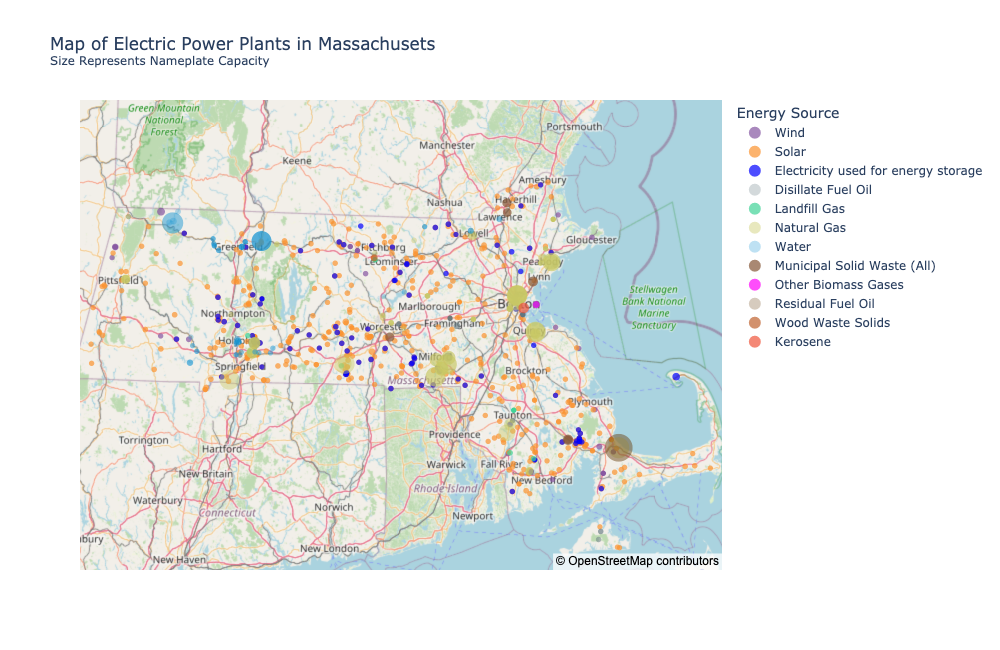

# EIA-API

This repository contains code to access the data available from the [API](https://www.eia.gov/opendata/) provided by the [U.S. Energy Information Administration (EIA)](https://www.eia.gov/). The bulk of the code is in `eia.py` where I define the `Eia class`. The script `get_eia_data.py` has some examples of how to use the class.

In this README, I briefly describe
- how to [register](#getting-started) for an API key and use it with my code,
- how the EIA's data is organized as a [tree structure](#understanding-the-organization-of-the-eias-data),
- how to use my code to [map that tree](#mapping-the-api-data-routes),
- how to [retrieve data](#retrieving-the-data) using filters defined by the EIA,
- how my code deals with [rate and data limits](#rate-limits-and-pagination),
- and how to [produce detailed dynamic and static maps](#creating-dynamic-and-static-maps-of-electric-power-plants-within-a-region) of electricity power plants within a region (new as of 2/15/2024).

# Getting Started
Before you can use the API, you must register for an API key by clicking on the EIA's Register button [here](https://www.eia.gov/opendata/). Once you've gone through the registration process, the EIA will email to you your API key.

The code in this repository will look for your API key in a file called `api_key.json`. Create an empty file with that name in your working directory and add the single line below putting your key in the appropriate location. Make sure to leave the quotation marks.
```
{"api_key" : "YOUR API KEY GOES HERE"}
```

Also, if you have a Mapbox API token that you want to use to generate dynamic and static maps using the `EIA.map_electric_plants` method [(see below)](#creating-dynamic-and-static-maps-of-electric-power-plants-within-a-region), add it to `api_key.json` as well. The resulting JSON will look as follows:
```
{"api_key": "YOUR API KEY GOES HERE",
"mapbox_token":"YOUR MAPBOX API KEY GOES HERE"}
```

# Understanding the Organization of the EIA's Data
As described in the [API Technical Documentation](https://www.eia.gov/opendata/documentation.php), the data is organized hierarchically as a tree in which each leaf contains data defined by the nodes in the path leading to it.

For example, one path through the tree to a leaf is
```
electricity/retail-sales
```
Another is
```
electricity/state-electricity-profiles/emissions-by-state-by-fuel
```

When you make an API call using just the path of a leaf, you do not receive data. Instead, you receive information about how to filter the data you will later ask for based on
- facets (state, sector, etc.), 
- frequencies (monthly, annual, hourly, etc.),
- and data columns (revenue, sales, total-consumption, etc.).

In the electricity/retail-sales example, the facets, frequencies, and data columns returned are
```
['stateid', 'sectorid']
['monthly', 'quarterly', 'annual']
['revenue', 'sales', 'price', 'customers']
```
When you do make an API call for data, you will specify facets, frequencies, and data columns as parameters to the call. See below on using `EIA.get_data_from_route` [for details](#retrieving-the-data).

# Mapping the API Data Routes
I find it useful to have a listing of the data routes I am interested in and the facets, frequencies, and data columns available for each.

The method `Eia.map_tree` does that. Given a parent node, `map_tree` recursively maps all of the child routes and returns a Pandas DataFrame that for each complete route has a list of facets, frequencies, and data columns. For example, we can map the tree under the `electricity` parent node and create a CSV file of it with the following code.
```
data_getter = eia.Eia()
elec_map_df = data_getter.map_tree(route='electricity')
elec_map_df.to_csv('elec_routes_map.csv')
```
The first few lines of the DataFrame/CSV file look like this:
| route | facet_list | freq_list | data_cols |
| ----- | ---------- | --------- | --------- |
| electricity/retail-sales | ['stateid', 'sectorid'] |['monthly', 'quarterly', 'annual'] | ['revenue', 'sales', 'price', 'customers']|
|electricity/electric-power-operational-data | ['location', 'sectorid', 'fueltypeid'] | ['monthly', 'quarterly', 'annual'] | ['generation', 'total-consumption', ..., 'ash-content', 'heat-content'] |
| electricity/rto/region-data | ['respondent', 'type'] |['hourly', 'local-hourly'] | ['value'] |

If you want a map of the entire organizational structure, use `map_tree` without specifying a route.
```
complete_map_df = data_getter.map_tree()
```

# Retrieving the Data
Once you understand the API's routes and data filters, you can use `Eia.get_data_from_route` to retrieve the data you are interested in. The method both returns a DataFrame of the data and saves the data to a CSV file.

It does this by adding `/data` to the end of a complete route. So in the eletricity retail sales example, the path would be
```
electricity/retail-sales/data
```
to the base URL of the EIA API.

For example, the following code retrieves data for electricity/retail-sales. It specifies the data columns, state and setor ID facets, and a monthly fequency.
```
data_getter = eia.Eia()
data_getter.get_data_from_route('electricity/retail-sales',
                                data_cols=['revenue', 'sales', 'price', 'customers'],
                                fcts_dict={'stateid':'MA', 'sectorid':'RES'},
                                freq_list=['monthly'])
```

`Eia.get_data_from_route` accepts other keyword arguments in addition to those shown. They include start and end dates for limiting your search, sorting paramters that let you sort by a particular column and set the sort to be ascending or descending, and an offset and number of rows to be returned (more on those two [below](#rate-limits-and-pagination)). It also has a `csv_file_name` argument that if specified sets the name of the csv file the method will create.

Be careful when you use facets. They are not consistent across routes even when you would expect them to be. For example, in one route's list of facets you may see `stateid` and in another's `stateID`. Using the `map_tree` method to produce a CSV file that contains facet information before retrieving data helps avoid using the wrong facet name.

# Rate Limits and Pagination
The EIA API documentation indicates that there are rate limits and that applications that make too many calls in quick succession will be temporarilly stopped from accessing the API. Unfortunately, the documentation does not specify what those limits are.

To head off potential rate limit issues, in `Eia.make_api_call` which handles all calls to the API, I have added a one second delay before making a call.

The EIA API documentation also specifies that it will return a maximum of 5,000 data rows at a time even if there are more data rows available. The method `EIA.get_data_from_route`, therefore, uses a combination of the API parameters `offset` and `length` (called `num_data_rows_per_call` in the argument list) to paginate the results to a maximum of 5,000 rows per page and then combines the pages into a single Pandas DataFrame to return. Essentially, `offset` tells the API how many rows to skip and `num_data_rows_per_call` tells the API how many rows to return. By initializing `offset` to 0 and then iteratively incrementing it by `num_data_rows_per_call` after each call, the method is able to retrieve all available data rows.

As described above, if you don't want all of the available data rows, you can filter the data using facets, frequency, and start and end dates. You can also set the offset and number of data rows to return.

# Creating Dynamic and Static Maps of Electric Power Plants within a Region

(New feature as of February 15, 2024)

The `Eia.map_electric_plants` method uses the [Plotly Express](https://plotly.com/python/plotly-express/) `scatter_mapbox` method to produce both dynamic and static maps of the locations of electric power plants within a region.

Use the `facets` keyword argument to specify the region of interest and use the `open_street` and `mapbox` boolean flags to specify whether you want to use [OpenStreetMap](https://www.openstreetmap.org/) map data and/or [Mapbox](https://www.mapbox.com/) data. Note that if you use Mapbox data, you will first need to register for an API token and add it to the `api_key.json` file as described [above](#eia-api). If you use OpenStreetMap, you do not need an API token. Consult the docstring in `eia.py` for more information about the method.

Below is an example showing a static map of the electric power plants in Massachusets.  The code, which also generates a dynamic HTML file, used to create the map is also shown. Note that the title string contains HTML tags which Plotly Express uses for formatting.
```
data_getter = eia.Eia()
data_getter.map_electric_plants(facets={'stateid':['MA']}, mapbox=False, open_street=True,
                                static_fig_title="Map of Electric Power Plants in Massachusets<br><sup>Size Represents Nameplate Capacity</sup>",
                                dynamic_fig_title="Map of Electric Power Plants in Massachusets<br><sup>Size Represents Nameplate Capacity<br>(hover for details)</sup>")
```



Also, note in the docstring that you can use keyword arguments to set the figure titles, initial zoom level, and width and height of the static images. The zoom, width, and height, are useful for fitting the inital view of the map to the total area you are examining.

## Keyword Arguments

`EIA.map_electric_plants` takes several key word arguments. I describe each below:

- `facets`: This is a dictionary of facets used to define the region of interest. In the examples above `facets={'stateid':['MA']}`. You could produce a map of all New England States with `facets={'stateid':['MA', "NH", "CT", "ME", "VT", "RI"]}`
- `start`: You can pretty much ignore this. The call to the EIA API needs a start date for the data it retrieves. Since the method uses only the latest reporting period, you should not need to change the default.
- `open_street`: If True (the default), it uses OpenStreetMap underlying map data.
- `mapbox`: If True (not the default), it uses Mapbox data and requires a Mapbox API token (see the README).
- `dynamic_fig_title`: The title to appear on the dynamic, interactive map
- `static_fig_title`: The title to appear on the static map
- `init_zoom`: The initial zoom level of the interactive map. The default is 7. You may need to adjust it depending on the size of the region.
- `open_street_file_name`: The file name (without suffix) to give to a map using OpenStreetMap data. The suffix is added automatically depending on whether it's dynamic (.html) or static (.png)
- `mapbox_file_name`: Just like the above but with regard to Mapbox
- `static_width`: The width of the static image. You may need to adjust from the default depending on the region.
- `static_height`: The height of the static image. You may need to adjust from the default depending on the region.


